Click on header or the chart for the code.

# 2025

## [Week 7: Agencies on the FBIs National Incident-Based Reporting System](https://github.com/doehm/tidytues/blob/main/scripts/2025/07%20-%20agencies/agencies.R)

## [Week 6: Saved CDC datasets](https://github.com/doehm/tidytues/blob/main/scripts/2025/06%20-%20cdc-datasets/cdc-datasets.R)

## [Week 5: The Simpsons](https://github.com/doehm/tidytues/blob/main/scripts/2025/05%20-%20simpsons/simpsons.R)

## [Week 4: Water Security](https://github.com/doehm/tidytues/blob/main/scripts/2025/04%20-%20water%20security/water%20security.R)

## [Week 3: Himalayan Expeditions](https://github.com/doehm/tidytues/blob/main/scripts/2025/03%20-%20himalaya/himalaya.R)

## [Week 2: posit::conf()](https://github.com/doehm/tidytues/blob/main/scripts/2025/02%20-%20post-conf/posit-conf.R)

## Week 1: BYOD

# 2024

## [Week 50: The Scent of Data](https://github.com/doehm/tidytues/blob/main/scripts/2024/week-50-perfume/perfume.R)

<a href='https://github.com/doehm/tidytues/blob/main/scripts/2024/week-50-perfume/perfume-final.png'>
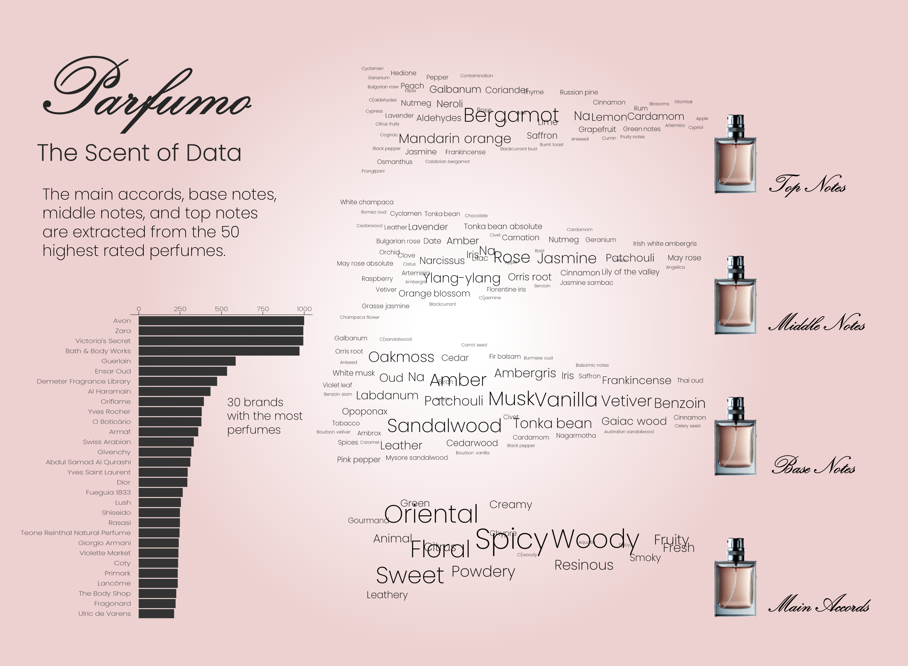</a>

## [Week 49: National Highways Traffic Flow](https://github.com/doehm/tidytues/blob/main/scripts/2024/week-49-traffic/traffic.R)

<a href='https://github.com/doehm/tidytues/blob/main/scripts/2024/week-49-traffic/traffic-final.png'>
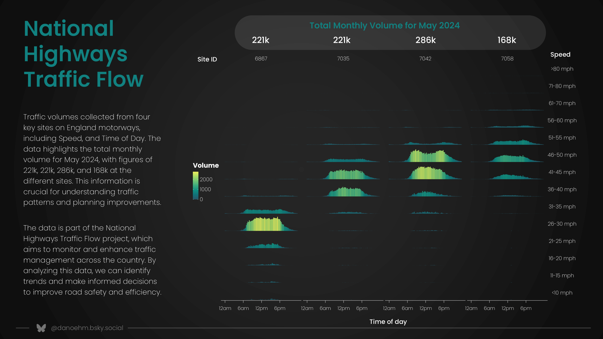</a>

## [Week 48: Customs and Border Control](https://github.com/doehm/tidytues/blob/main/scripts/2024/week-48-border-control/border-control.R)

<a href='https://github.com/doehm/tidytues/blob/main/scripts/2024/week-48-border-control/border-control-final.png'>
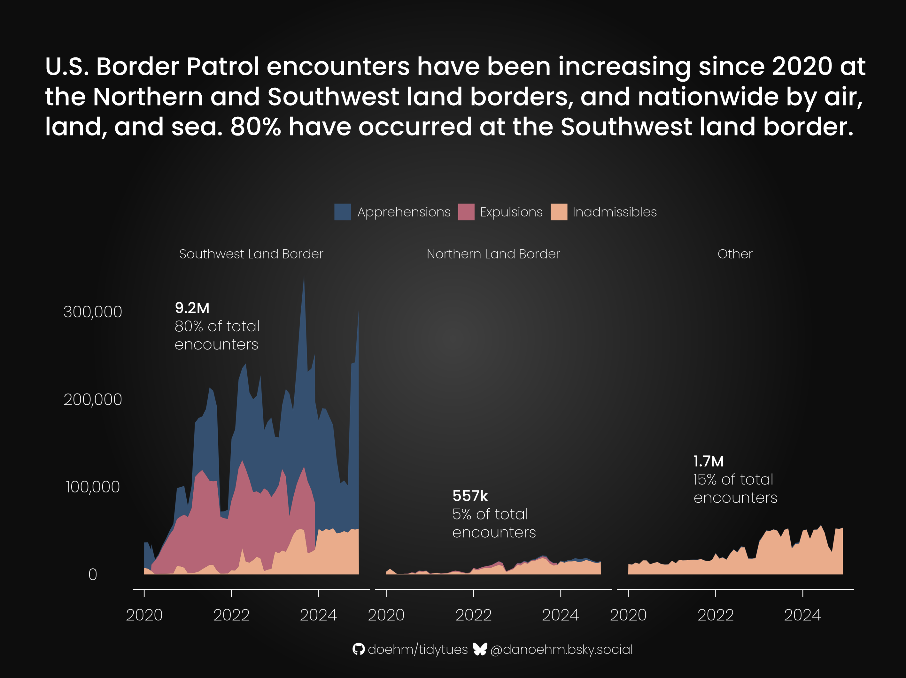</a>

# 2023

## [Week 52: R Package Structure](https://github.com/doehm/tidytues/blob/main/scripts/2023/week-52-cran/cran.R)

<a href='https://github.com/doehm/tidytues/blob/main/scripts/2023/week-52-cran/cran.png'>
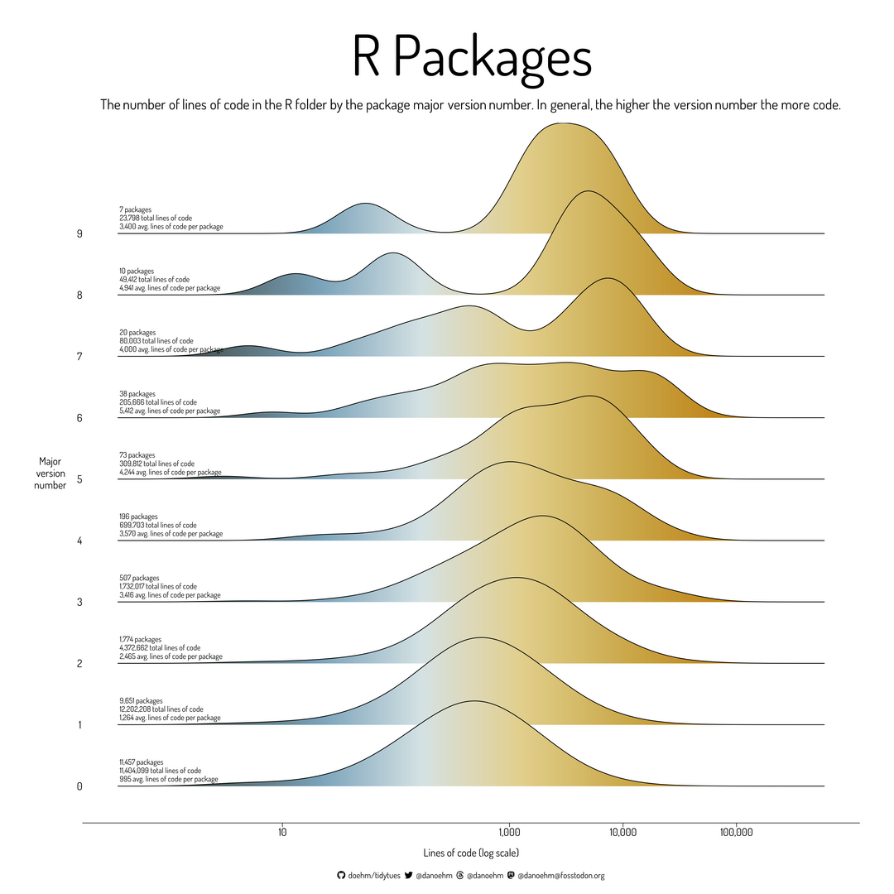</a>

## [Week 51: Holiday Episodes](https://github.com/doehm/tidytues/blob/main/scripts/2023/week-51-holiday-episodes/holiday-episodes.R)

<a href='https://github.com/doehm/tidytues/blob/main/scripts/2023/week-51-holiday-episodes/holiday-episodes.png'>
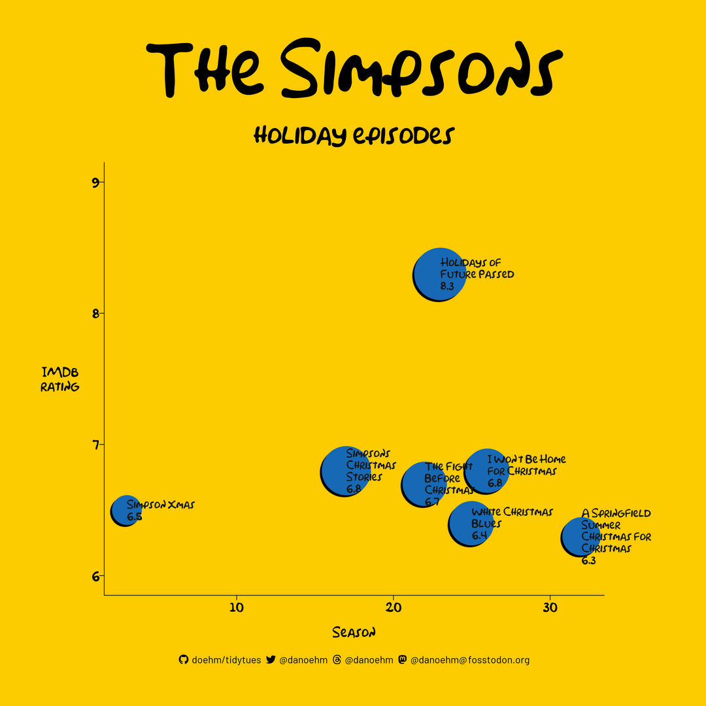</a>

## [Week 50: Christmas Movies](https://github.com/doehm/tidytues/blob/main/scripts/2023/week-50-christmas-movies/christmas-movies.R)

<a href='https://github.com/doehm/tidytues/blob/main/scripts/2023/week-50-christmas-movies/christmas-movies.png'>
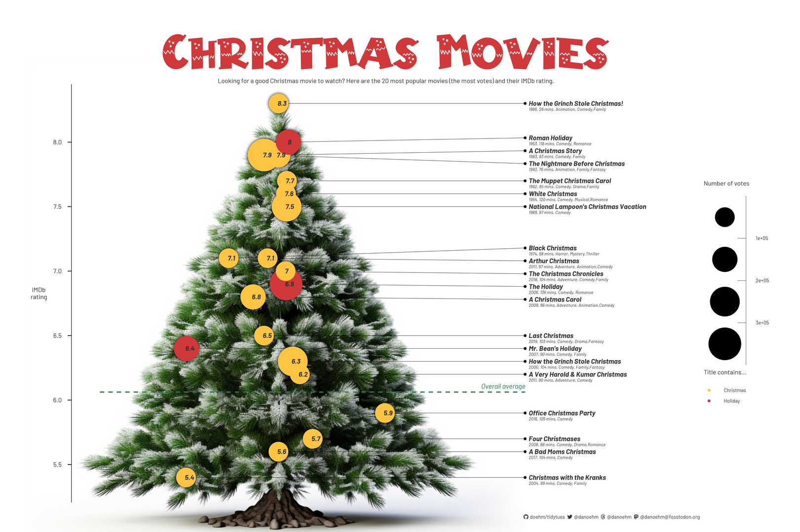</a>

## [Week 49: Life Expectancy](https://github.com/doehm/tidytues/blob/main/scripts/2023/week-49-life-expectancy/life-expectancy.R)

<a href='https://github.com/doehm/tidytues/blob/main/scripts/2023/week-49-life-expectancy/life-expectancy.png'>
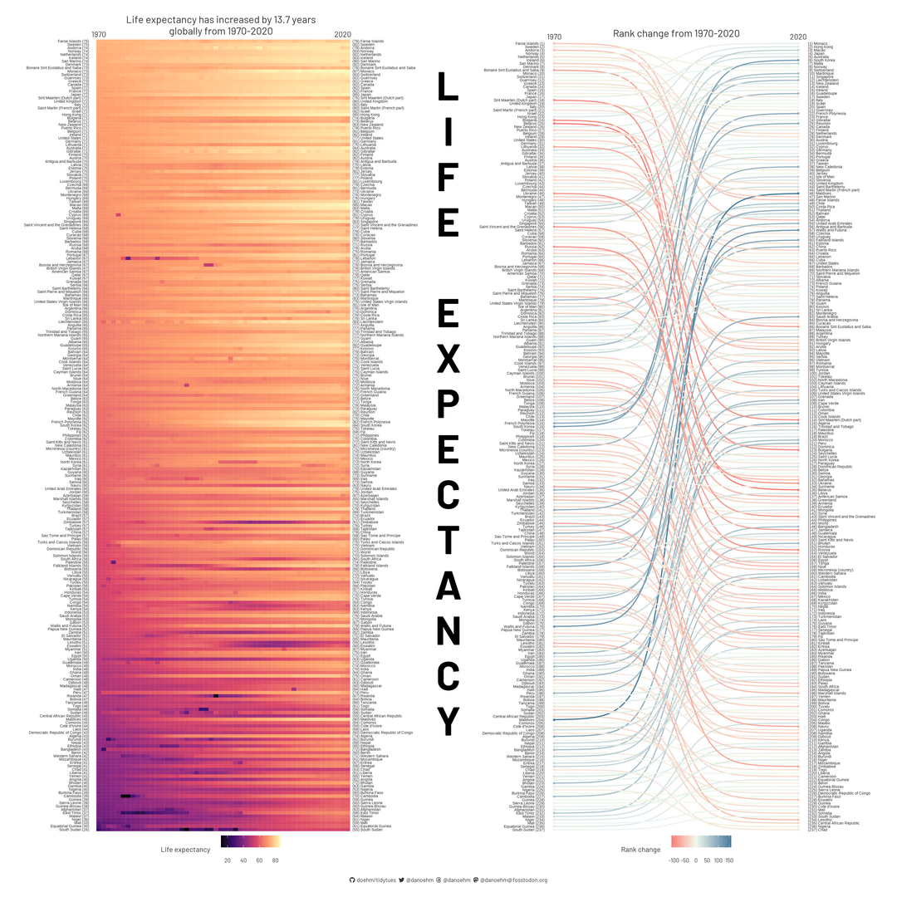</a>
<a href='https://github.com/doehm/tidytues/blob/main/scripts/2023/week-49-life-expectancy/life-expectancy.png'>
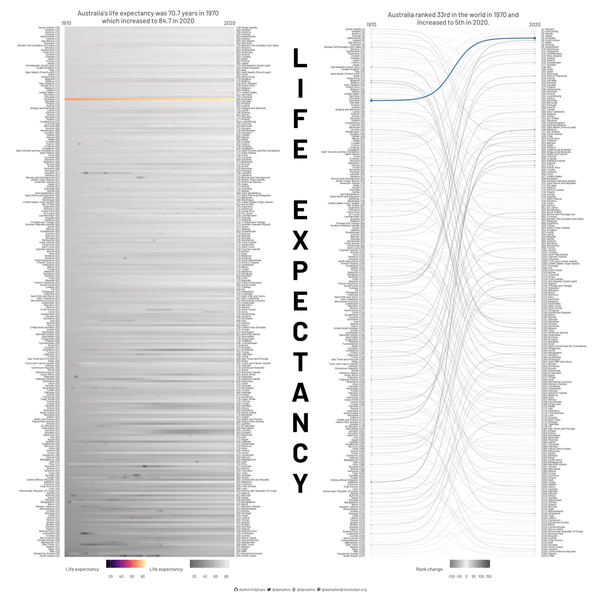</a>

## [Week 48: Dr Who](https://github.com/doehm/tidytues/blob/main/scripts/2023/week-48-dr-who/dr-who.R)

<a href='https://github.com/doehm/tidytues/blob/main/scripts/2023/week-48-dr-who/dr-who.png'>
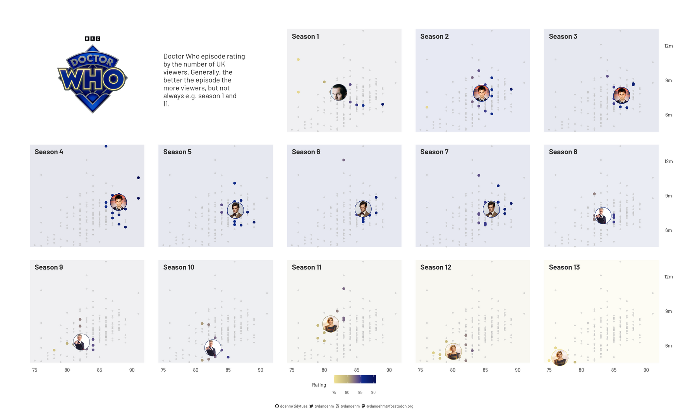</a>

## [Week 47: Rladies](https://github.com/doehm/tidytues/blob/main/scripts/2023/week-47-rladies/rladies.R)

<a href='https://github.com/doehm/tidytues/blob/main/scripts/2023/week-47-rladies/rladies.png'>
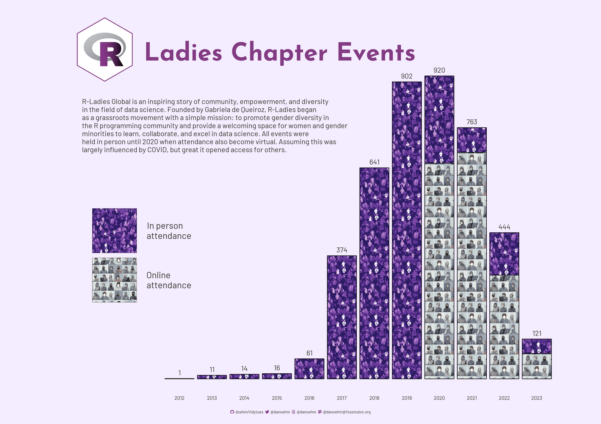</a>

## [Week 46: Diwali](https://github.com/doehm/tidytues/blob/main/scripts/2023/week-46-diwali/diwali.R)

<a href='https://github.com/doehm/tidytues/blob/main/scripts/2023/week-46-diwali/diwali.png'>
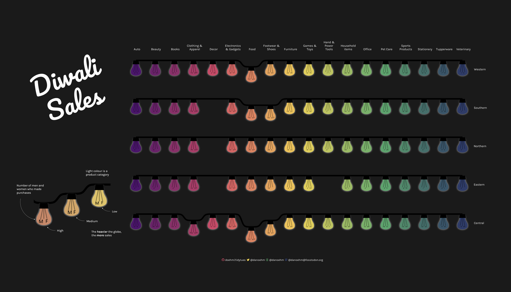</a>

## [Week 45: US House Election Results](https://github.com/doehm/tidytues/blob/main/scripts/2023/week-45-house/house.R)

<a href='https://github.com/doehm/tidytues/blob/main/scripts/2023/week-45-house/house.png'>
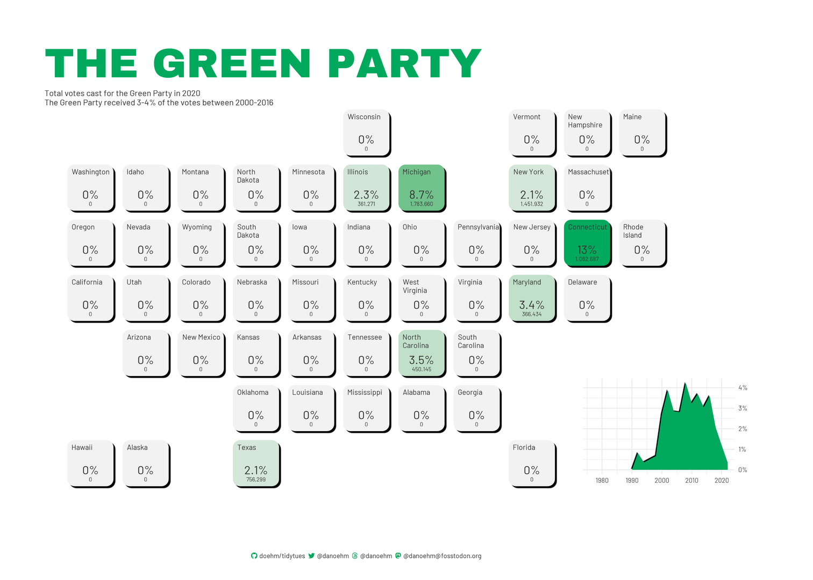</a>

## [Week 44: Horror Articles](https://github.com/doehm/tidytues/blob/main/scripts/2023/week-44-horror-articles/horror-articles.R)

<a href='https://github.com/doehm/tidytues/blob/main/scripts/2023/week-44-horror-articles/horror-articles.png'>
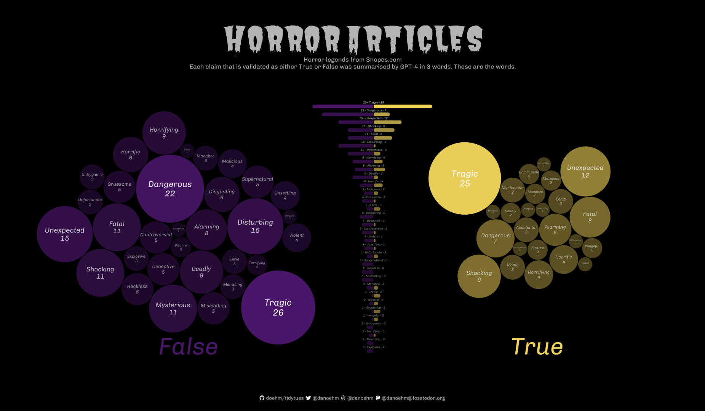</a>

## [Week 43: Patient Risk Profiles](https://github.com/doehm/tidytues/blob/main/scripts/2023/week-43-patient-risk-profiles/patient-risk-profiles.R)

<a href='https://github.com/doehm/tidytues/blob/main/scripts/2023/week-43-patient-risk-profiles/patient-risk-profiles.png'>
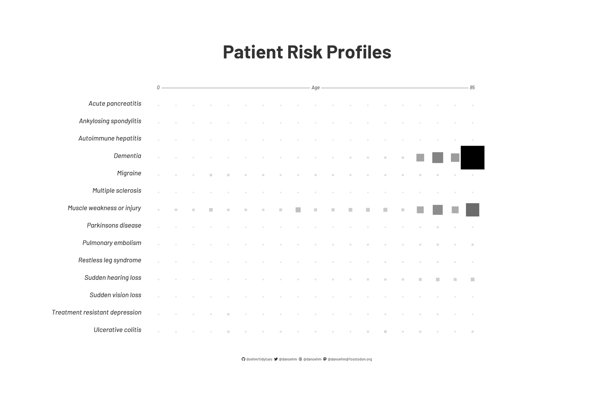</a>

## [Week 42: Taylor Swift](https://github.com/doehm/tidytues/blob/main/scripts/2023/week-42-taylor-swift/taylor-swift.R)

## [Week 41: Haunted Places](https://github.com/doehm/tidytues/blob/main/scripts/2023/week-41-haunted-places/haunted-places.R)

## [Week 40: US Grants](https://github.com/doehm/tidytues/blob/main/scripts/2023/week-40-US-grants/US-grants.R)

<a href='https://github.com/doehm/tidytues/blob/main/scripts/2023/week-40-US-grants/US-grants.png'>
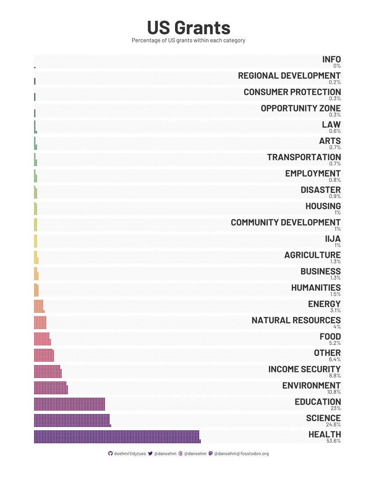</a>

## [Week 39: Roy Kent F\*\*k Count](https://github.com/doehm/tidytues/blob/main/scripts/2023/week-39-roy-kent-f-count/roy-kent-f-count.R)

## [Week 38: CRAN](https://github.com/doehm/tidytues/blob/main/scripts/2023/week-38-cran/cran.R)

<a href='https://github.com/doehm/tidytues/blob/main/scripts/2023/week-38-cran/cran.png'>
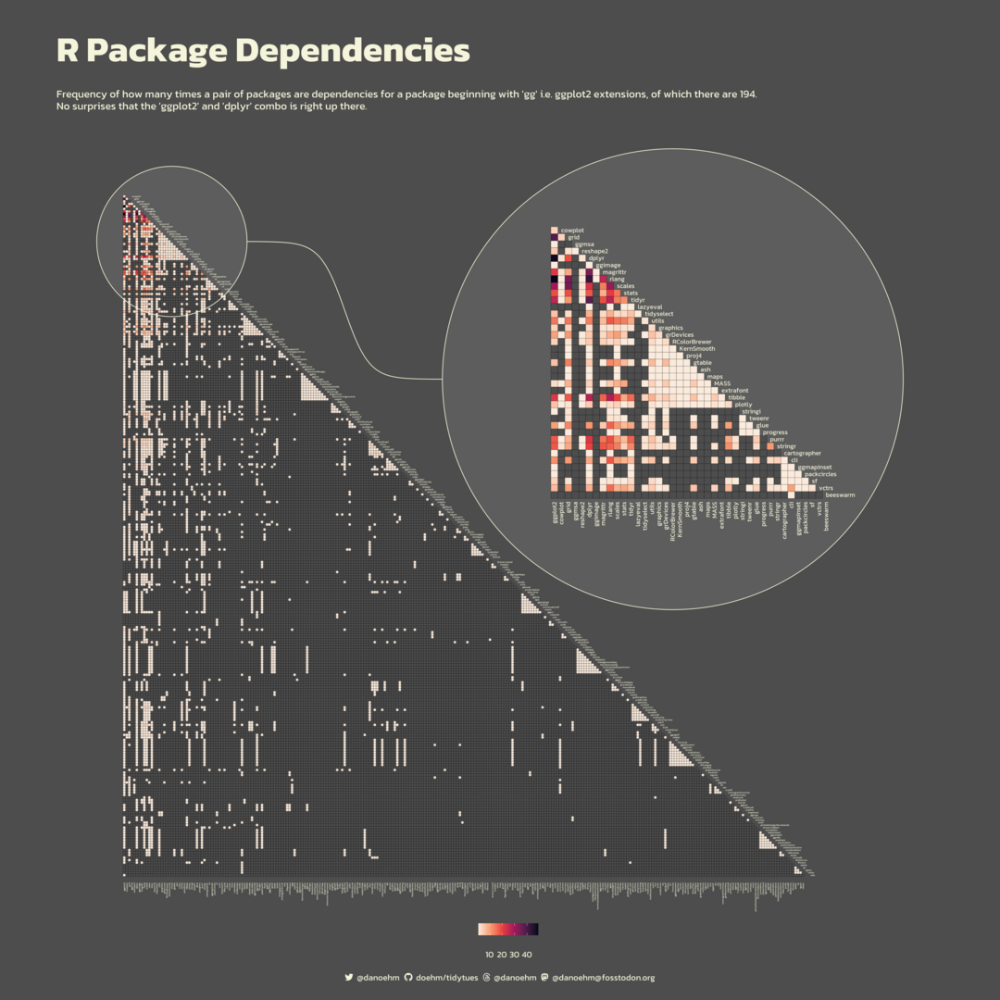</a>

## [Week 37: Global Human Day](https://github.com/doehm/tidytues/blob/main/scripts/2023/week-37-global-human-day/global-human-day.R)

<a href='https://github.com/doehm/tidytues/blob/main/scripts/2023/week-37-global human day/global-human-day.png'>
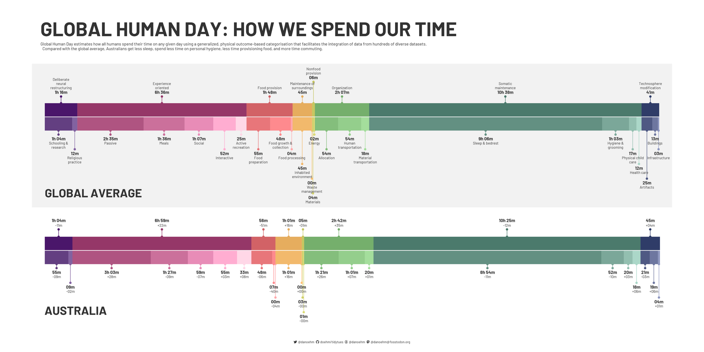</a>

## [Week 36: Unions](https://github.com/doehm/tidytues/blob/main/scripts/2023/week-36-unions/unions.R)

## [Week 35: Copyright](https://github.com/doehm/tidytues/blob/main/scripts/2023/week-35-copyright/copyright.R)

<a href='https://github.com/doehm/tidytues/blob/main/scripts/2023/week-35-copyright/copyright.png'>
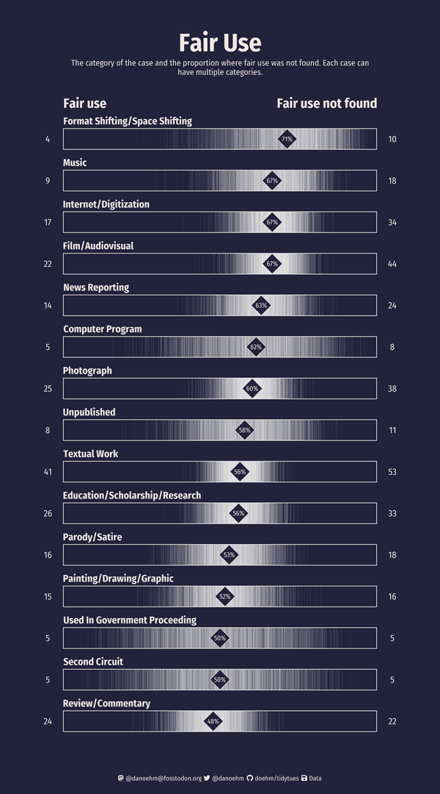</a>

## [Week 34: Refugees](https://github.com/doehm/tidytues/blob/main/scripts/2023/week-34-refugees/refugees.R)

<a href='https://github.com/doehm/tidytues/blob/main/scripts/2023/week-34-refugees/refugees.R'>
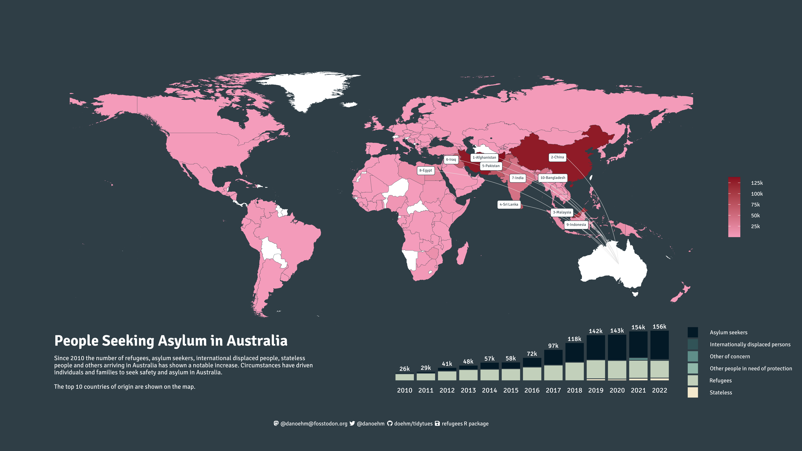</a>

## [Week 33: Spam](https://github.com/doehm/tidytues/blob/main/scripts/2023/week-33-Spam/Spam.R)

<a href='https://github.com/doehm/tidytues/blob/main/scripts/2023/week-33-spam/spam.R'>
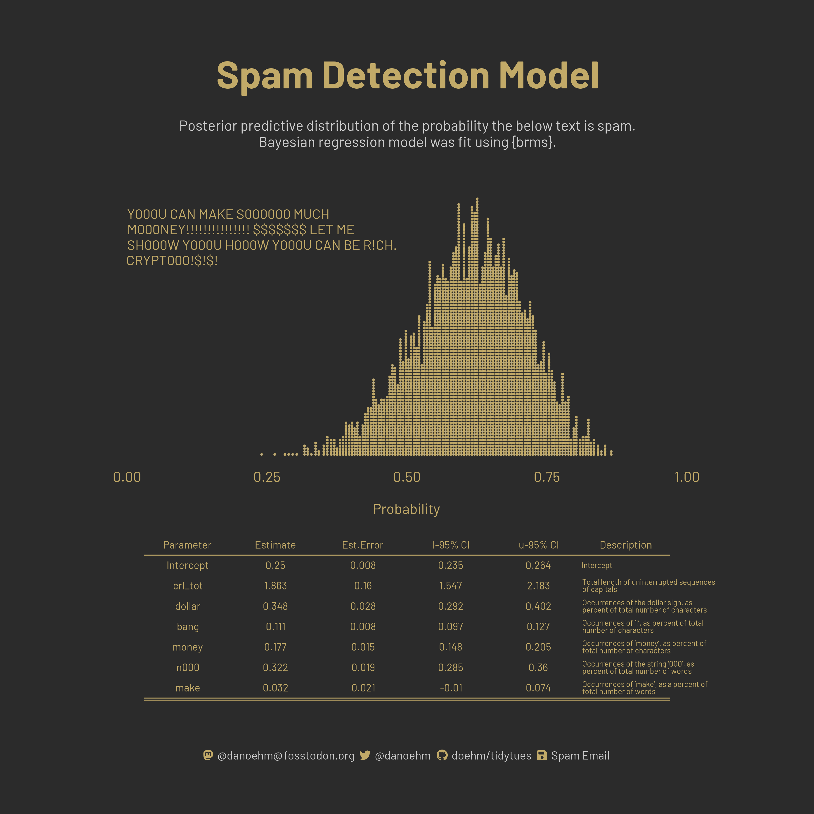</a>

## [Week 32: Hot Ones](https://github.com/doehm/tidytues/blob/main/scripts/2023/week-32-hot-ones/hot-ones.R)

<a href='https://github.com/doehm/tidytues/blob/main/scripts/2023/week-32-hot-ones/hot-ones.R'>
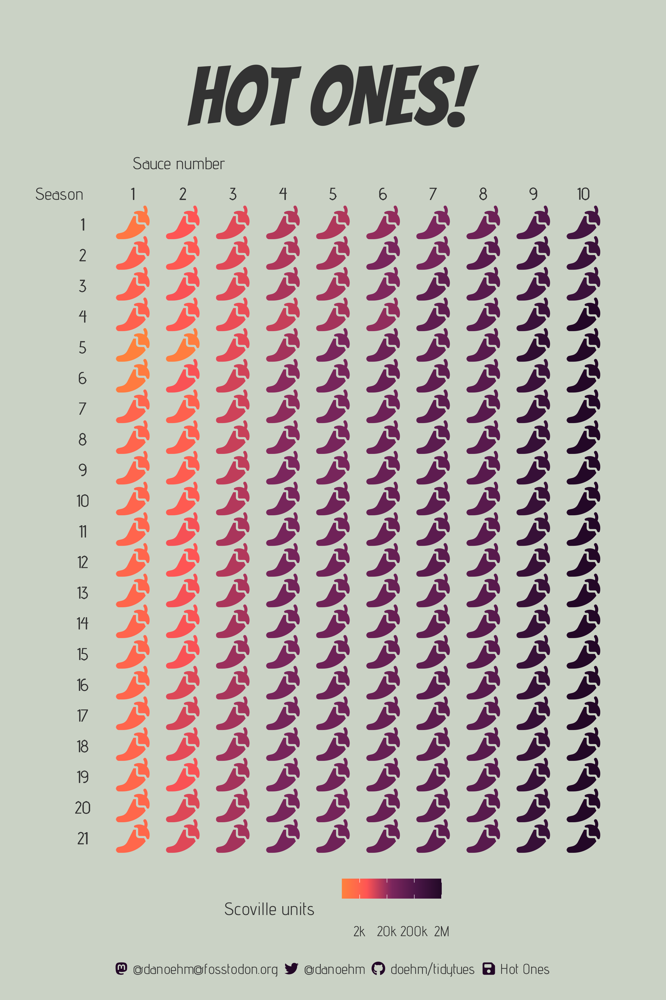</a>

## [Week 31: US States](https://github.com/doehm/tidytues/blob/main/scripts/2023/week-31-us-states/us-states.R)

<a href='https://github.com/doehm/tidytues/blob/main/scripts/2023/week-31-us-states/us-states.R'>
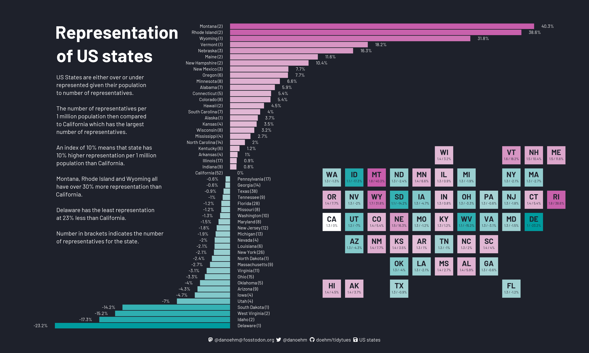</a>

## [Week 30: Scurvy](https://github.com/doehm/tidytues/blob/main/scripts/2023/week-30-scurvy/scurvy.R)

Sorry. Somehow my script was deleted and is lost forever. I blame my 2
year old.

## [Week 29: GPT detectors](https://github.com/doehm/tidytues/blob/main/scripts/2023/week-29-gpt/gpt.R)

<a href='https://github.com/doehm/tidytues/blob/main/scripts/2023/week-29-gpt/gpt.R'>
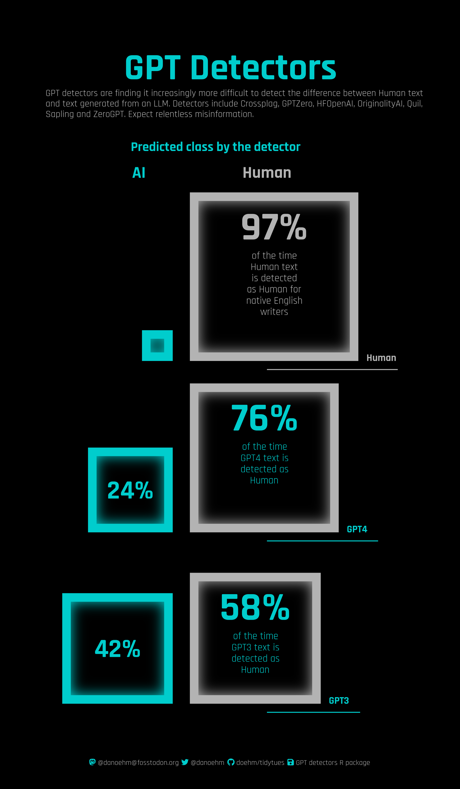</a>

## [Week 28: Global Surface Temperatures](https://github.com/doehm/tidytues/blob/main/scripts/2023/week-28-temperatures/temperatures.R)

<a href='https://github.com/doehm/tidytues/blob/main/scripts/2023/week-28-temperatures/temperatures.R'>
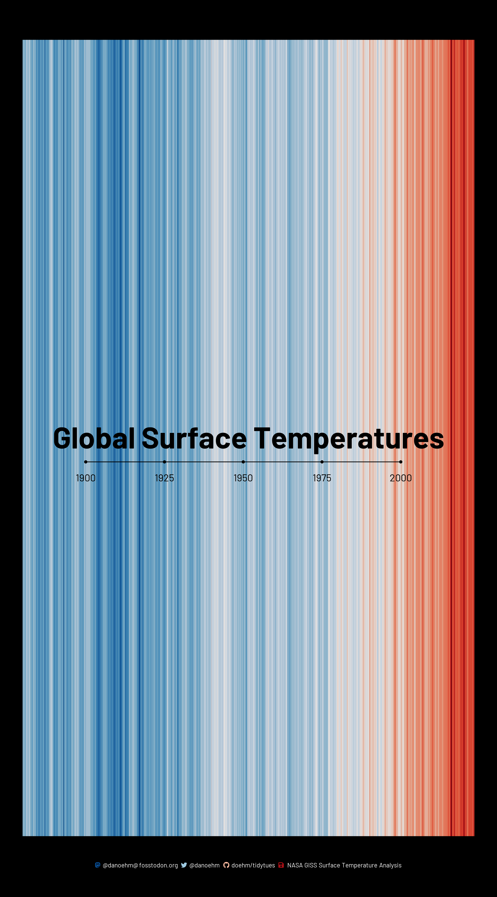</a>
<a href='https://github.com/doehm/tidytues/blob/main/scripts/2023/week-28-temperatures/temperatures.R'>
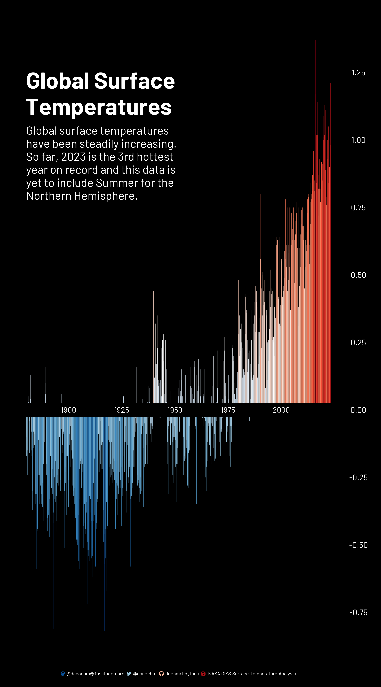</a>

## [Week 27: Historical Markers](https://github.com/doehm/tidytues/blob/main/scripts/2023/week-27-markers/markers.R)

<a href='https://github.com/doehm/tidytues/blob/main/scripts/2023/week-27-markers/markers.R'>
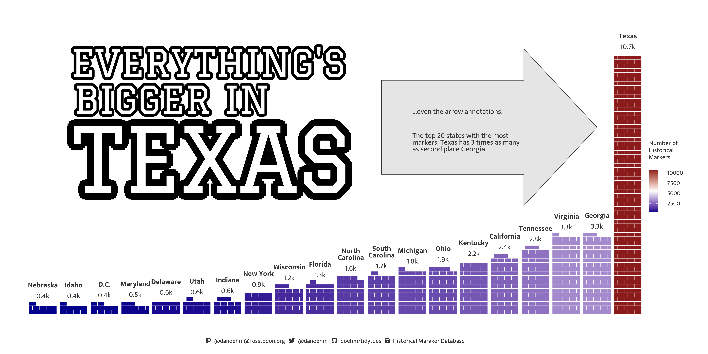</a>

## [Week 26: US Places](https://github.com/doehm/tidytues/blob/main/scripts/2023/week-26-us-places/us-places.R)

## [Week 25: UFO Sightings](https://github.com/doehm/tidytues/blob/main/scripts/2023/week-25-ufo/ufo.R)

<a href='https://github.com/doehm/tidytues/blob/main/scripts/2023/week-25-ufo/ufo.png'>
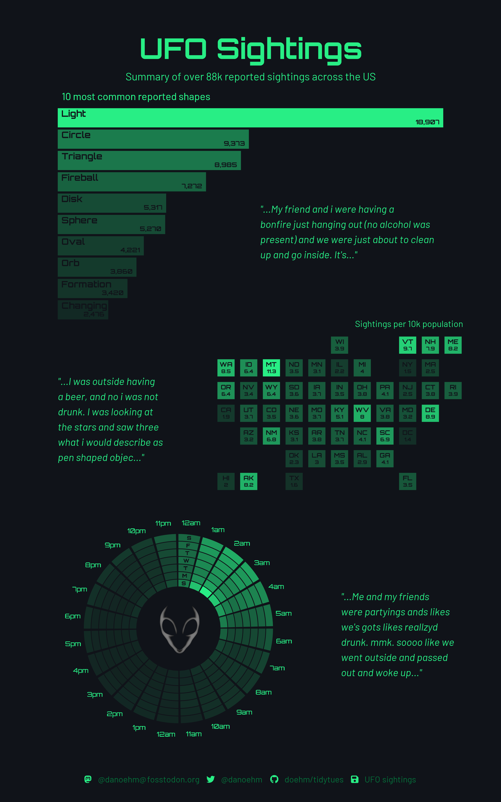</a>

## [Week 24: SAFI Survey Data](https://github.com/doehm/tidytues/blob/main/scripts/2023/week-24-safi/safi.R)

<a href='https://github.com/doehm/tidytues/blob/main/scripts/2023/week-24-safi/safi.png'>
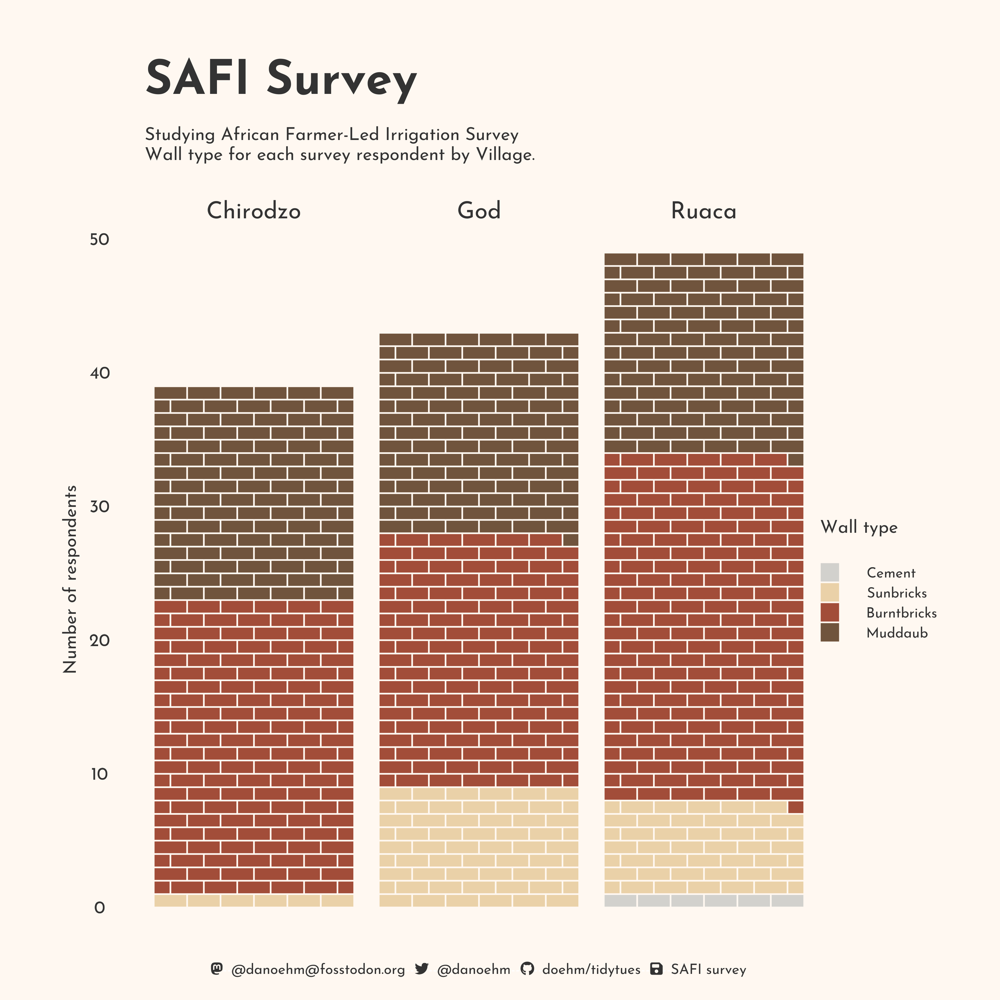</a>

## [Week 23: Energy Production](https://github.com/doehm/tidytues/blob/main/scripts/2023/week-23-energy/energy.R)

## [Week 22: Centenarians](https://github.com/doehm/tidytues/blob/main/scripts/2023/week-22-centenarians/centenarians.R)

## [Week 21: Squirrels](https://github.com/doehm/tidytues/blob/main/scripts/2023/week-21-squirrels/squirrels.R)

## [Week 20: Tornadoes](https://github.com/doehm/tidytues/blob/main/scripts/2023/week-20-tornados/tornados.R)

<a href='https://github.com/doehm/tidytues/blob/main/scripts/2023/week-20-tornados/tornados.png'>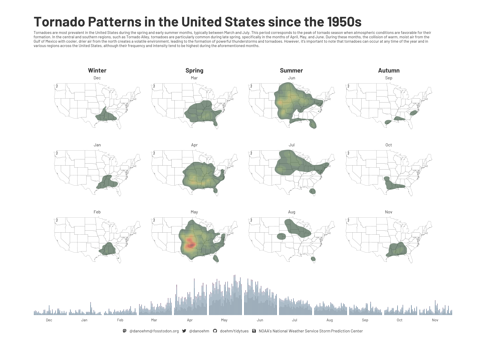</a>

## [Week 19: Childcare services](https://github.com/doehm/tidytues/blob/main/scripts/2023/week-19-childcare/childcare.R)

<a href='https://github.com/doehm/tidytues/blob/main/scripts/2023/week-19-childcare/childcare.png'>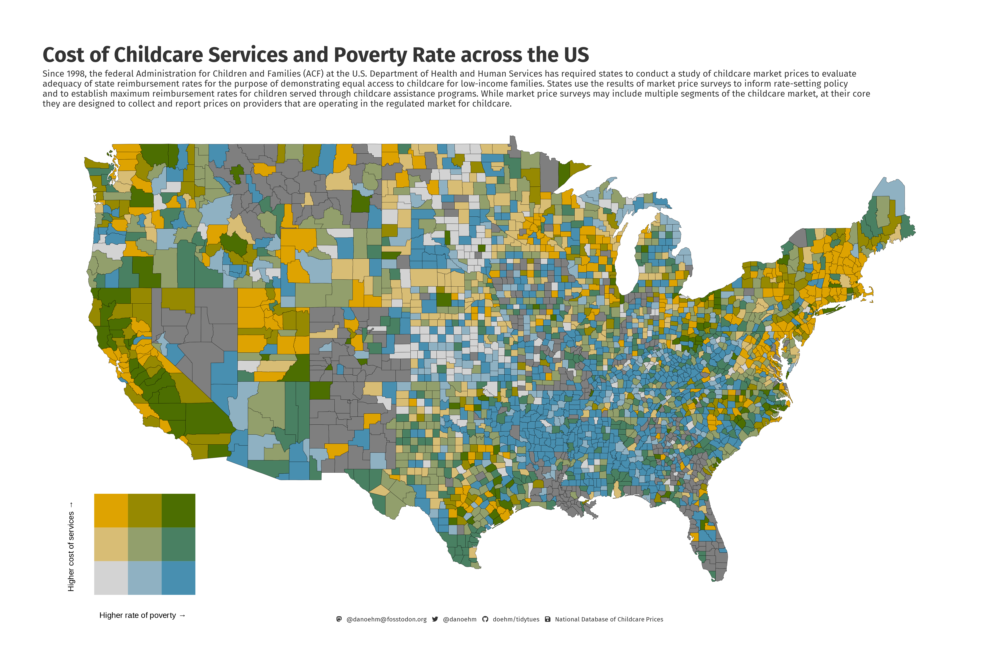</a>

## [Week 18: Portal Project](https://github.com/doehm/tidytues/blob/main/scripts/2023/week-18-portal/portal.R)

<a href='https://github.com/doehm/tidytues/blob/main/scripts/2023/week-18-portal/portal.png'>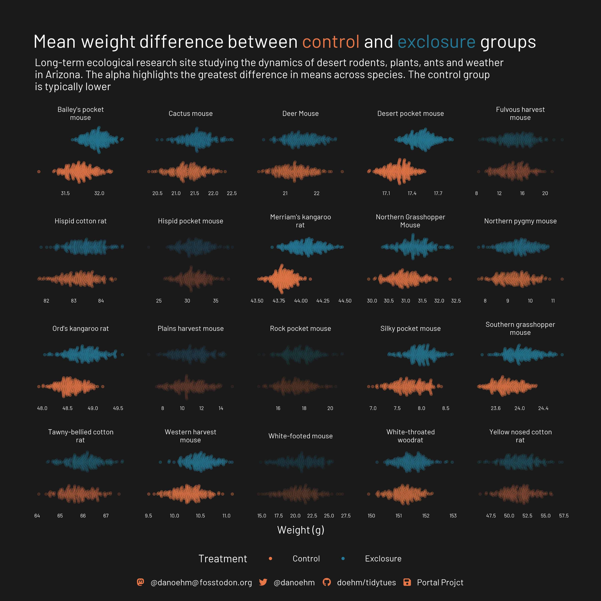</a>

## [Week 17: London Marathon](https://github.com/doehm/tidytues/blob/main/scripts/2023/week-17-london-marathon/london-marathon.R)

## [Week 16: Founder crops](https://github.com/doehm/tidytues/blob/main/scripts/2023/week-16-crops/crops.R)

<a href='https://github.com/doehm/tidytues/blob/main/scripts/2023/week-16-crops/crops.R'>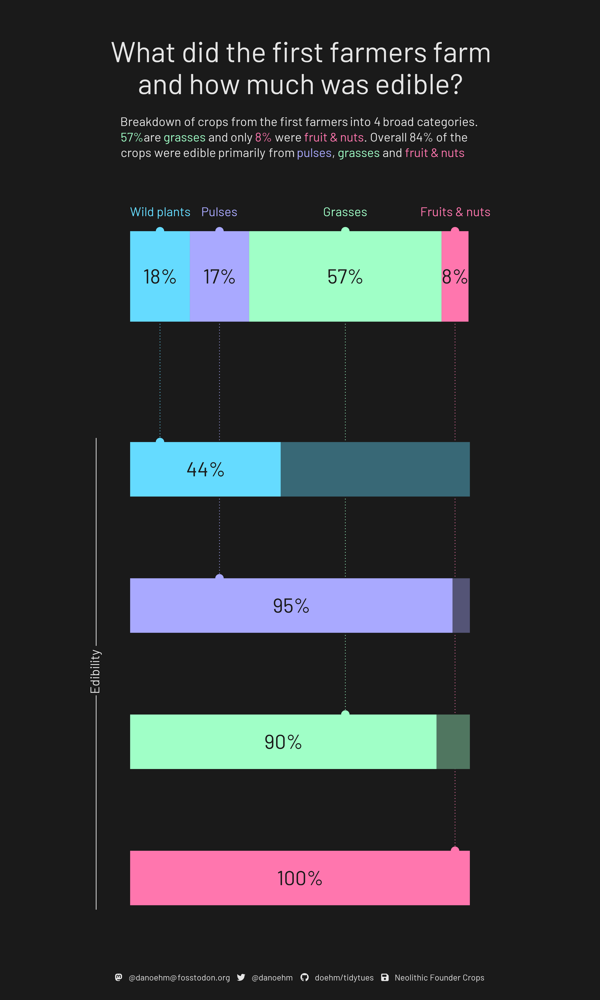</a>

## [Week 15: US Egg Production](https://github.com/doehm/tidytues/blob/main/scripts/2023/week-15-eggs/eggs.R)

## [Week 14: Premier League 2021-2022](https://github.com/doehm/tidytues/blob/main/scripts/2023/week-14-soccer/soccer.R)

<a href='https://github.com/doehm/tidytues/blob/main/scripts/2023/week-14-soccer/soccer.R'>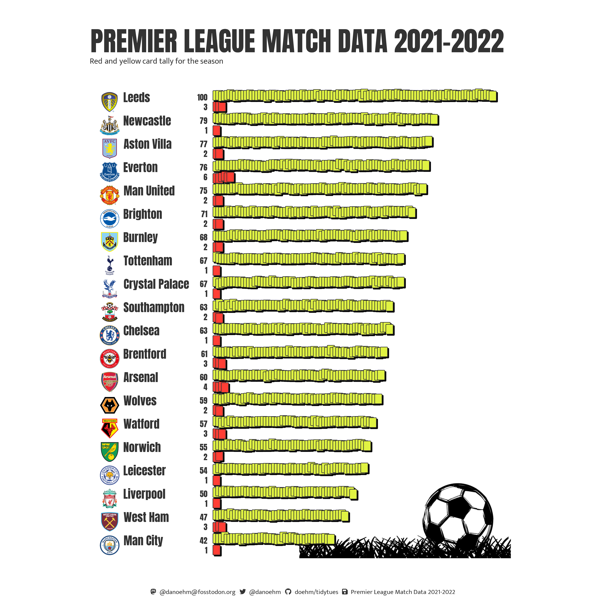</a>

## [Week 13: Time zones](https://github.com/doehm/tidytues/blob/main/scripts/2023/week-13-timezones/timezones.R)

## [Week 12: Programming Languages](https://github.com/doehm/tidytues/blob/main/scripts/2023/week-12-languages/lagnuages.R)

## [Week 11: European drug development](https://github.com/doehm/tidytues/blob/main/scripts/2023/week-11-drugs/drugs.R)

## [Week 10: Numbats](https://github.com/doehm/tidytues/blob/main/scripts/2023/week-10-numbts/numbats.R)

<a href='https://github.com/doehm/tidytues/blob/main/scripts/2023/week-10-numbats/numbats.R'>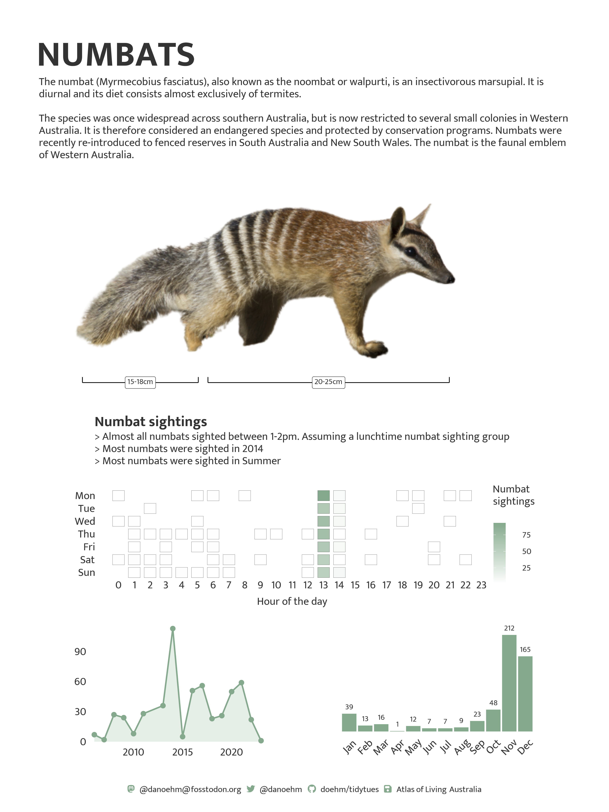</a>

## [Week 9: African sentiment analysis](https://github.com/doehm/tidytues/blob/main/scripts/2023/week-09-afrisenti/afrisenti.R)

<a href='https://github.com/doehm/tidytues/blob/main/scripts/2023/week-09-afrisenti/afrisenti.R'>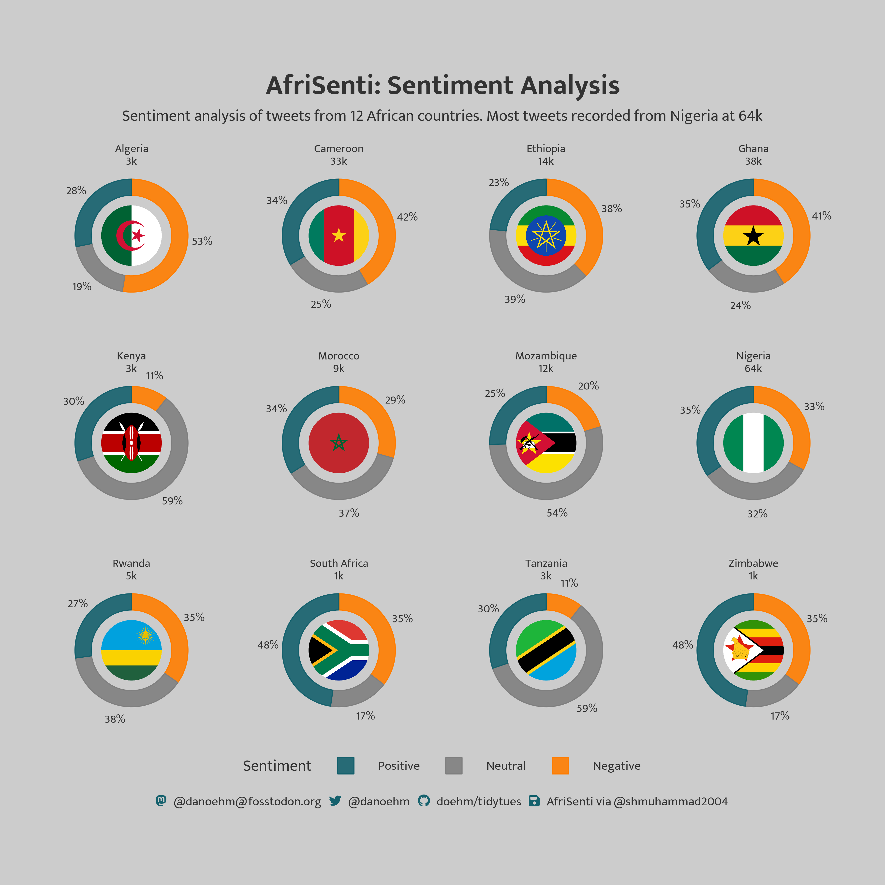</a>

## [Week 8: Bob Ross Paintings](https://github.com/doehm/tidytues/blob/main/scripts/2023/week-08-bob-ross/bob-ross.R)

## [Week 7: Hollywood Relationships](https://github.com/doehm/tidytues/blob/main/scripts/2023/week-07-hollywood/hollywood.R)

<a href='https://github.com/doehm/tidytues/blob/main/scripts/2023/week-07-hollywood/hollywood.R'>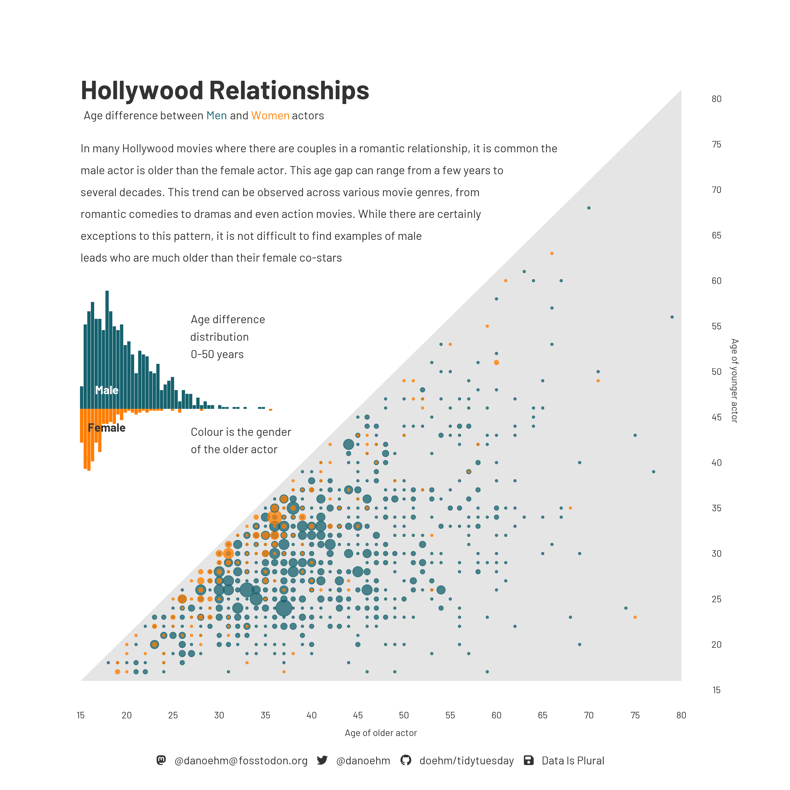</a>

## [Week 6: Tech](https://github.com/doehm/tidytues/blob/main/scripts/2023/week-06-tech/tech.R)

## [Week 5: Cats](https://github.com/doehm/tidytues/blob/main/scripts/2023/week-05-cats/cats.R)

## [Week 4: Alone](https://github.com/doehm/tidytues/blob/main/scripts/2023/week-04-alone/alone.R)

## [Week 3: Art history](https://github.com/doehm/tidytues/blob/main/scripts/2023/week-03-artists/artists.R)

## [Week 2: Project FeederWatch](https://github.com/doehm/tidytues/blob/main/scripts/2023/week-02-birds/birds.R)

## [Week 1: BYOD](https://github.com/doehm/tidytues/blob/main/scripts/2023/week-01-BYOD/mischa.R)

# 2022

## [Week 52: Star Trek](https://github.com/doehm/tidytues/blob/main/scripts/2022/week-52-star-trek/star-trek.R)

## [Week 51: Weather forecasts](https://github.com/doehm/tidytues/blob/main/scripts/2022/week-51-weather/weather.R)

## [Week 50: US Monthly Retail Sales](https://github.com/doehm/tidytues/blob/main/scripts/2022/week-50-retail/retail.png)

## [Week 49: Elevators of NYC](https://github.com/doehm/tidytues/blob/main/scripts/2022/week-49-elevators/elevators.R)

<a href='https://github.com/doehm/tidytues/blob/main/scripts/2022/week-49-elevators/elevators.R'>
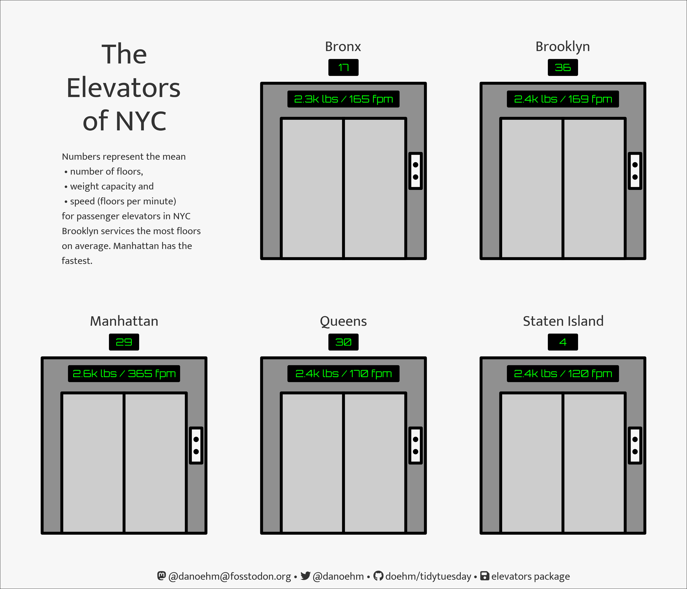 </a>

## [Week 48: FIFA World Cup](https://github.com/doehm/tidytues/blob/main/scripts/2022/week-48-FIFA-world-cup/FIFA-world-cup.R)

<a href='https://github.com/doehm/tidytues/blob/main/scripts/2022/week-48-FIFA-world-cup/FIFA-world-cup.R'>
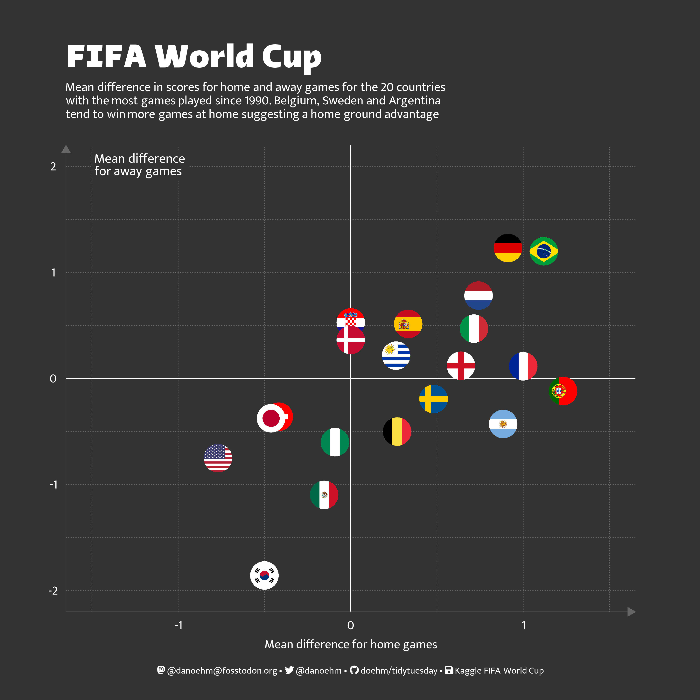
</a>

For reasons that I don’t fully understand I had to decommission my old
repo. I will one day migrate it over here but in the meantime here is a
link to my [Old TidyTuesday repo](https://github.com/doehm/tidyTuesday)

