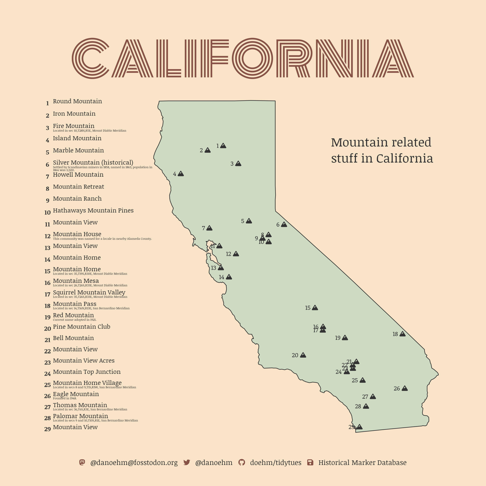
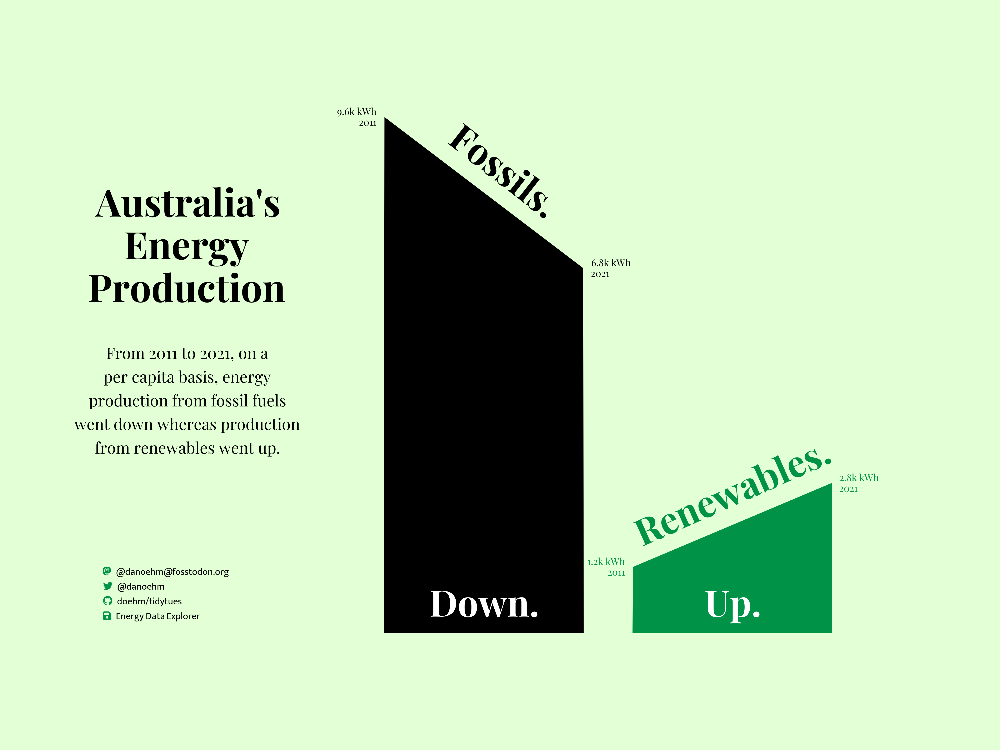
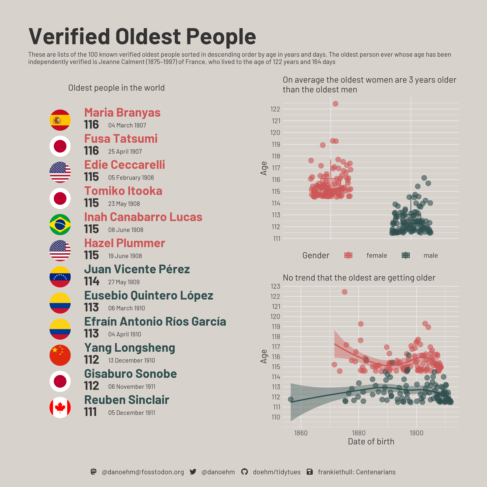
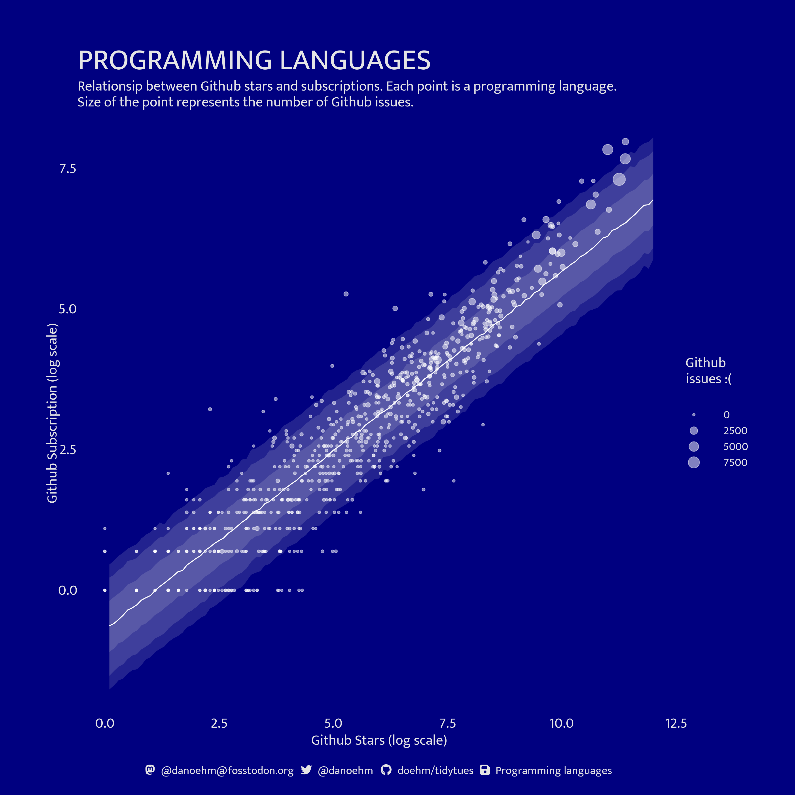
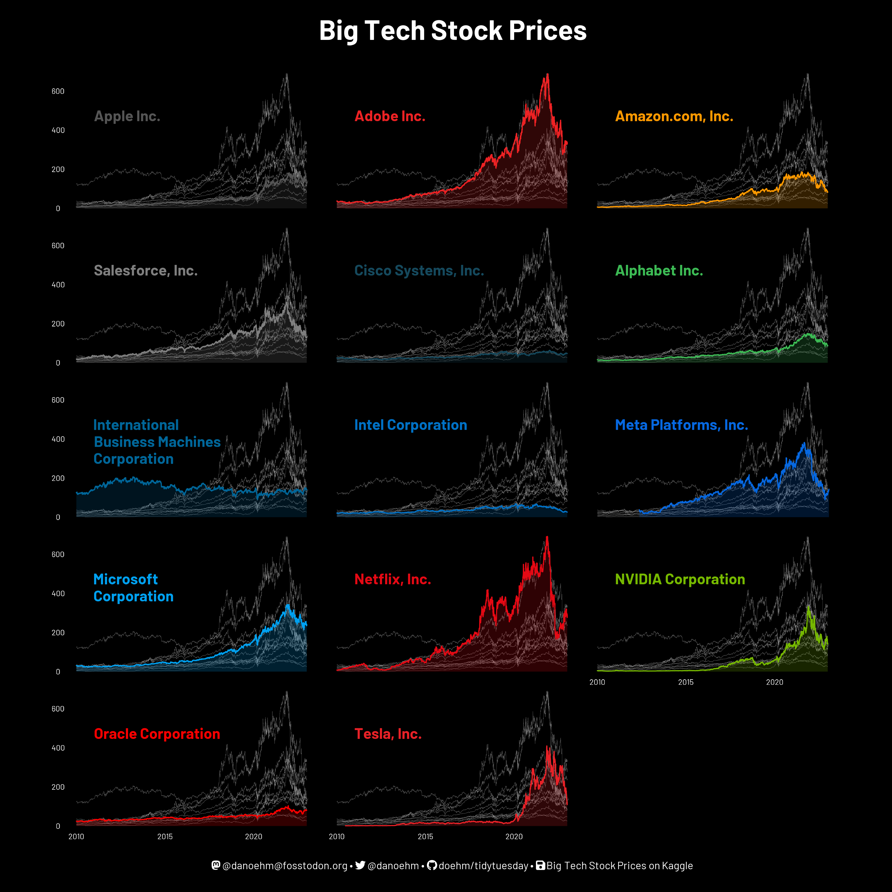
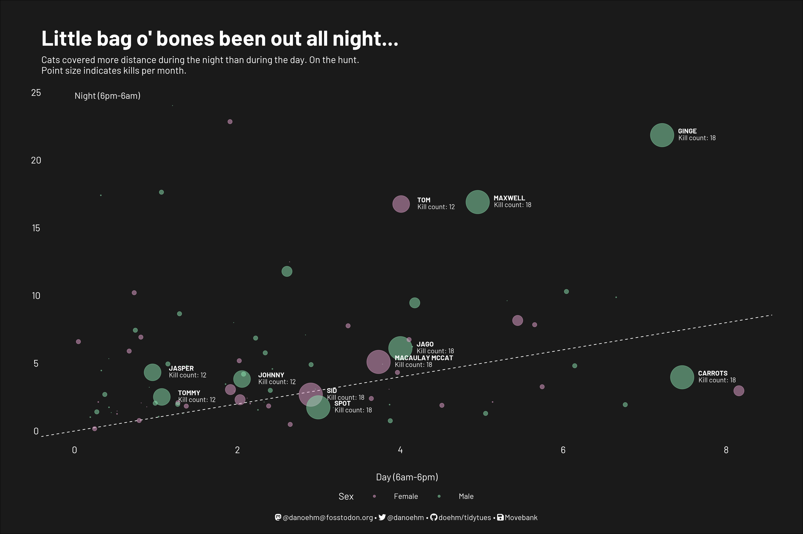
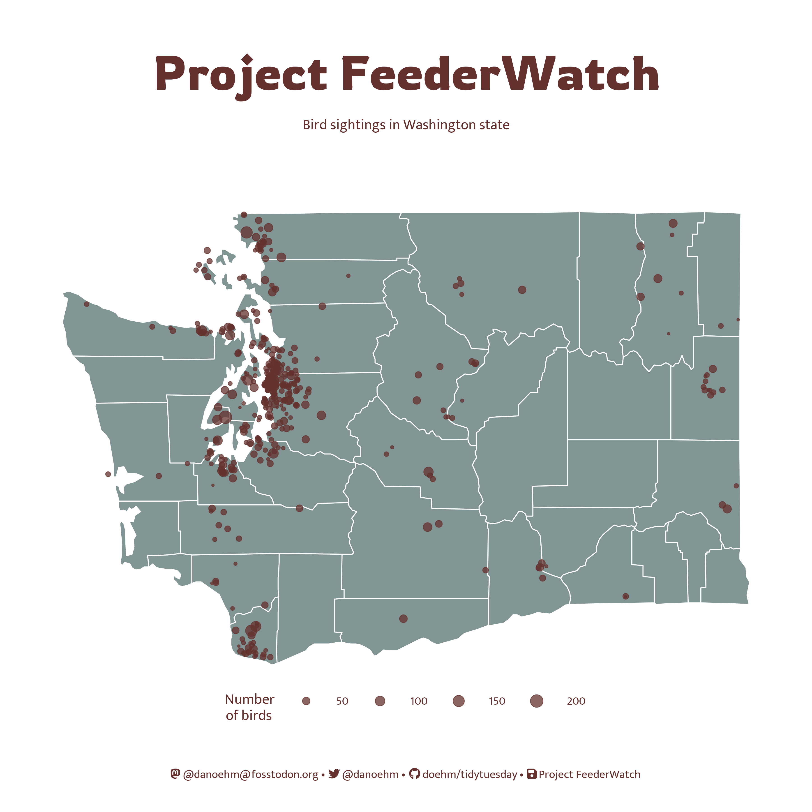
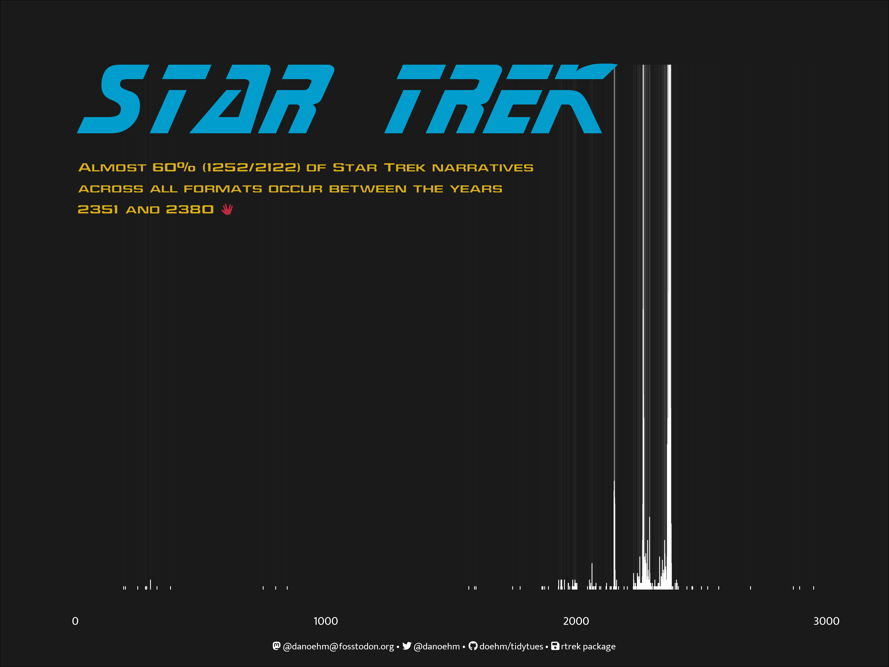
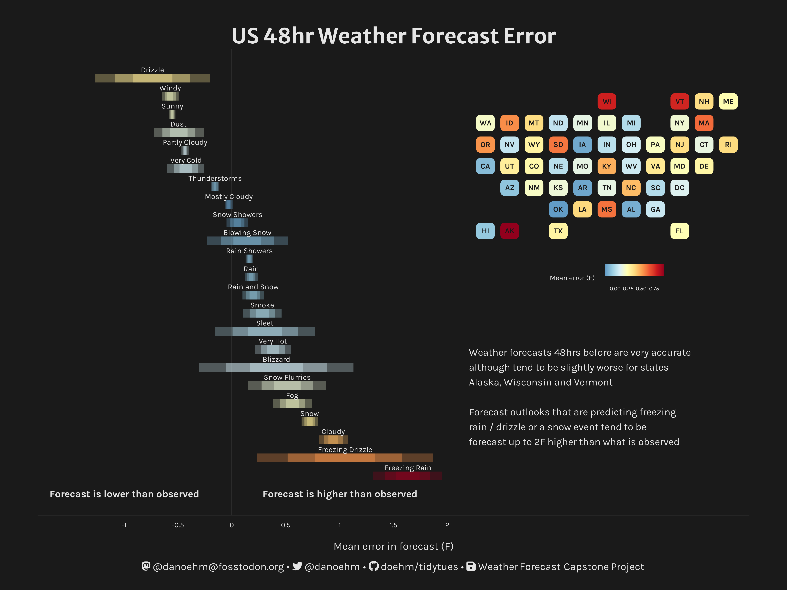

Click on header or the chart for the code.

For reasons that I don’t fully understand I had to decommission my old
repo. I will one day migrate it over here but in the meantime here is a
link to my [Old TidyTuesday repo](https://github.com/doehm/tidyTuesday)

## [Week 26: US Places](https://github.com/doehm/tidytues/blob/main/scripts/2023/week-26-us-places/us-places.R)

## [Week 25: UFO Sightings](https://github.com/doehm/tidytues/blob/main/scripts/2023/week-25-ufo/ufo.R)

## [Week 24: SAFI Survey Data](https://github.com/doehm/tidytues/blob/main/scripts/2023/week-24-safi/safi.R)

## [Week 23: Energy Production](https://github.com/doehm/tidytues/blob/main/scripts/2023/week-23-energy/energy.R)

## [Week 22: Centenarians](https://github.com/doehm/tidytues/blob/main/scripts/2023/week-22-centenarians/centenarians.R)

## [Week 21: Squirrels](https://github.com/doehm/tidytues/blob/main/scripts/2023/week-21-squirrels/squirrels.R)

## [Week 20: Tornadoes](https://github.com/doehm/tidytues/blob/main/scripts/2023/week-20-tornados/tornados.R)

## [Week 19: Childcare services](https://github.com/doehm/tidytues/blob/main/scripts/2023/week-19-childcare/childcare.R)

## [Week 18: Portal Project](https://github.com/doehm/tidytues/blob/main/scripts/2023/week-18-portal/portal.R)

## [Week 17: London Marathon](https://github.com/doehm/tidytues/blob/main/scripts/2023/week-17-london-marathon/london-marathon.R)

## [Week 16: Founder crops](https://github.com/doehm/tidytues/blob/main/scripts/2023/week-16-crops/crops.R)

## [Week 15: US Egg Production](https://github.com/doehm/tidytues/blob/main/scripts/2023/week-15-eggs/eggs.R)

## [Week 14: Premier League 2021-2022](https://github.com/doehm/tidytues/blob/main/scripts/2023/week-14-soccer/soccer.R)

## [Week 13: Time zones](https://github.com/doehm/tidytues/blob/main/scripts/2023/week-13-timezones/timezones.R)

## [Week 12: Programming Languages](https://github.com/doehm/tidytues/blob/main/scripts/2023/week-12-languages/lagnuages.R)

## [Week 11: European drug development](https://github.com/doehm/tidytues/blob/main/scripts/2023/week-11-drugs/drugs.R)

## [Week 10: Numbats](https://github.com/doehm/tidytues/blob/main/scripts/2023/week-10-numbts/numbats.R)

## [Week 9: African sentiment analysis](https://github.com/doehm/tidytues/blob/main/scripts/2023/week-9-afrisenti/afrisenti.R)

## [Week 8: Bob Ross Paintings](https://github.com/doehm/tidytues/blob/main/scripts/2023/week-8-bob-ross/bob-ross.R)

## [Week 7: Hollywood Relationships](https://github.com/doehm/tidytues/blob/main/scripts/2023/week-7-hollywood/hollywood.R)

## [Week 6: Tech](https://github.com/doehm/tidytues/blob/main/scripts/2023/week-6-tech/tech.R)

## [Week 5: Cats](https://github.com/doehm/tidytues/blob/main/scripts/2023/week-5-cats/cats.R)

## [Week 4: Alone](https://github.com/doehm/tidytues/blob/main/scripts/2023/week-4-alone/alone.R)

## [Week 3: Art history](https://github.com/doehm/tidytues/blob/main/scripts/2023/week-3-artists/artists.R)

## [Week 2: Project FeederWatch](https://github.com/doehm/tidytues/blob/main/scripts/2023/week-2-birds/birds.R)

## [Week 1: BYOD](https://github.com/doehm/tidytues/blob/main/scripts/2023/week-1-BYOD/mischa.R)

# 2022

## [Week 52: Star Trek](https://github.com/doehm/tidytues/blob/main/scripts/2022/week-52-star-trek/star-trek.R)

## [Week 51: Weather forecasts](https://github.com/doehm/tidytues/blob/main/scripts/2022/week-51-weather/weather.R)

## [Week 50: US Monthly Retail Sales](https://github.com/doehm/tidytues/blob/main/scripts/2022/week-50-retail/retail.png)

## [Week 49: Elevators of NYC](https://github.com/doehm/tidytues/blob/main/scripts/2022/week-49-elevators/elevators.R)

## [Week 48: FIFA World Cup](https://github.com/doehm/tidytues/blob/main/scripts/2022/week-48-FIFA-world-cup/FIFA-world-cup.R)

